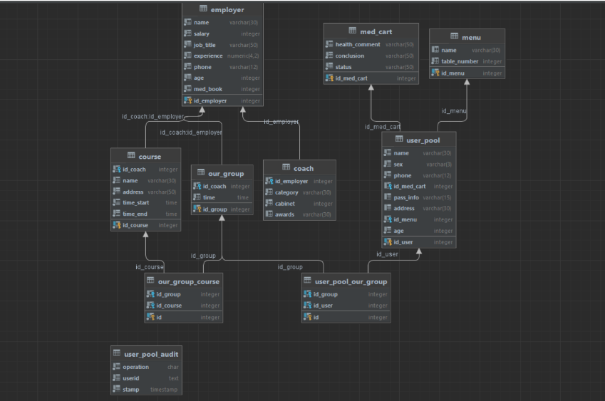

## Разработка базы данных "Оздоровительный комплекс "Водолей"" и клиентского приложения для доступа к ней

Предметной областью настоящей работы является база данных,
которая помогает данному заведению структурировано и удобно вести учёт
своих клиентов.

Таким
образом, в данном проекте «Водолей» были осуществлены и проработаны
такие вопросы, как добавление и удаление пользователей, нахождение
пользователя и сотрудника по ID, создание группы, просмотр групп,
добавление пользователя в группу и добавление группы в курс.
---
#### В серверной части проекта было реализовано:

1) Создание логической модели базы данных. Была использована ER модель 
2) Реализация модели в СУБД. Для системы управления базами данных был использован сервер PostgreSQL. Был осуществлен перенос ER моделей в виде таблиц в базу данных.
3) Первоначальное заполнение базы данных
4) Создание запросов
5) Создание хранимых функций, процедур и триггеров

